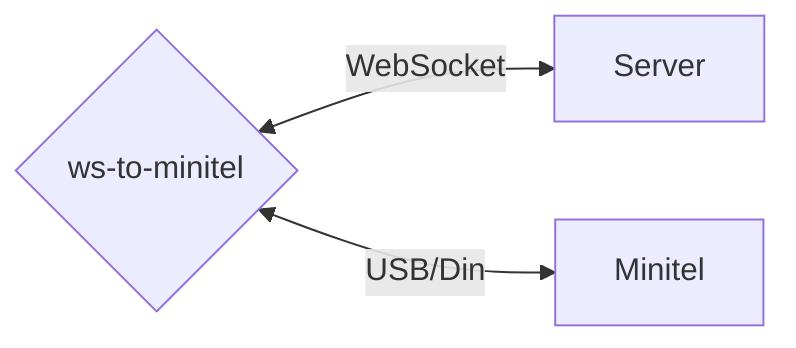

# ws-to-minitel

A tool to bridge the gap between a [MiEdit](https://github.com/Zigazou/miedit/blob/master/EMULATOR.md) compatible WebSocket server and a
[Minitel](https://en.wikipedia.org/wiki/Minitel) terminal connected to a computer.



There has been a resurgence of interest in the Minitel and a few services are now available online and accessible via an emulator.

But if you own a real Minitel, you might want to connect it to the Internet and use it to access these services.

This simple command line tool connects to such a service and pipes the data to/from the Minitel.

As a bonus feature, it can tell when the Minitel is turned on and will reconnect to the server at that moment, or if the connection is lost.
This way you can leave the tool running and just turn your Minitel on when you want to use it.

## Usage

Download the app from the [latest release](https://github.com/BoD/ws-to-minitel/releases/latest) page.

If your Minitel is connected to a Linux computer (e.g. a Raspberry Pi) you can use the binary executable. Please choose either
the 32 or 64 bits version depending on your system. For other systems, a JVM version is available.

```
ws-to-minitel --url <WebSocket URL> --input-output <Minitel device>
```

For example, if your Minitel is connected to `/dev/ttyUSB0` and you want to connect to [MiniPAVI](https://www.minipavi.fr/):

```
ws-to-minitel --url ws://go.minipavi.fr:8182 --input-output /dev/ttyUSB0
```

### Options

```
  -u, --url=<url>             WebSocket URL to connect to, e.g.
                              wss://example.com:8080/ws
  -io, --input-output=<file>  File where to read from the keyboard and write to
                              the screen, e.g. /dev/ttyUSB0. Either
                              --input-output or both --input and --output must
                              be provided.
  -i, --input=<file>          File where to read from the keyboard, e.g.
                              /dev/ttyUSB0. Either --input-output or both
                              --input and --output must be provided.
  -o, --output=<file>         File where to write to the screen, e.g.
                              /dev/ttyUSB0. Either --input-output or both
                              --input and --output must be provided.
  -e, --local-echo=(on|off|neither)
                              Send a local echo on or off command first. By
                              default, local echo off is sent. Use 'neither' to
                              not send any command. (default: OFF)
  -s, --save-frames=<text>    Save received frames to files in the specified
                              directory. Files will be named frame-<frame
                              number>.vdt.
  -l, --log-level=(debug|info|warn|none)
                              Set the log level (default: INFO)
  -h, --help                  Show this message and exit
```

## Acknowledgements

This is a Kotlin rewrite of [cquest](https://github.com/cquest)'s [websocket2minitel](https://github.com/cquest/websocket2minitel).

```
Copyright (C) 2025-present Benoit 'BoD' Lubek (BoD@JRAF.org)

This program is free software: you can redistribute it and/or modify
it under the terms of the GNU General Public License as published by
the Free Software Foundation, either version 3 of the License, or
(at your option) any later version.

This program is distributed in the hope that it will be useful,
but WITHOUT ANY WARRANTY; without even the implied warranty of
MERCHANTABILITY or FITNESS FOR A PARTICULAR PURPOSE.  See the
GNU General Public License for more details.

You should have received a copy of the GNU General Public License
along with this program.  If not, see <http://www.gnu.org/licenses/>.
```
